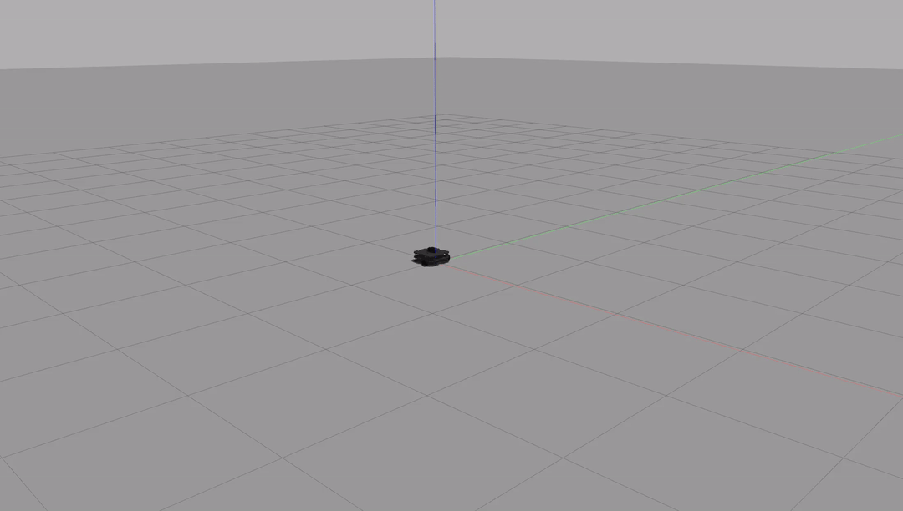

# warmup_project

## Driving in Square

To drive in a sqaure, I made the robot drive straight for 4 seconds at 0.25 m/s, so 1 meter in total. Then I turned the robot 90 degrees. This was done by setting the angular velocity to pi/10 rad/s for a total of 5 seconds. The code for this task is contained in a single `run()` method within the `DriveSquare` class. The code utilizes a rospy `rate` object, which I found to be very helpful for timing the robot movements. The outer loop is executed 4 times, to drive in a single square. Two inner loops control the turning and forward movement of the robot. 

## Person Follower

The general strategy was to adjust the angular velocity and linear velocity of the robot with proportional control. The `angle` can be found from the scan topic by finding the value in the `data.ranges` array of minimum distance. I then convert this angle to radians, and the angular velocity is updated by `K_ang * angle` where `K_ang = 0.50` is the proportional constant for angular velocity. Similarly, for the linear velocity the update is `K_lin * max(0.0, min_dist - stop_dist)`. Here `min_dist` is the distance corresponding to `angle`, and `stop_dist` is defined as 0.5. The `max` is to ensure we stop moving once we are `stop_dist` away from the person. However, linear velocity is only added when the person is directly in front of the robot. Otherwise the robot would take unnecessary long arcs to orient itself correctly. 

My code has a `scanner()` function that is the callback for the scan topic, as well as a `shutdown()` function which publishes an empty `Twist()` message. 

## Wall Follower

For this one, we keep track of the distances at 0 and 270 degrees, named `front_dist` and `side_dist` respectively. There is also a variable called `angle` which represents the angle to the closest wall from the robot. The `angle` variable is used to align the robot parallel to the closest wall. The robot can be placed anywhere, and using proportional control, it will align itself parallel to the closest wall by setting its angular velocity to `K_ang*(np.pi / 2.0 + angle)`. The linear velocity is updated by the formula `min(0.5,max(0.0,K_lin*(front_dist - stop_dist)))`. The `min` part is to handle the case where the lidar reading at the front of the robot gives an infinite distance. The `max` part is proportional control as used in the person follower. These two velocity updates will keep the robot parallel to the wall at its side, and it will slow down the robot once it is within `stop_dist` of the wall in front of it. When this happens, the `front_dist` will be less than `side_dist` and `angle` will immediately switch to be near the front of the robot. This is how the robot knows when it is time to turn, and it will experience a strong adjustment in angular velocity, which will turn it to the left. 

This is the main logic of my strategy, but there are a few extra things I added to make sure the robot rides smoothly. First of all, `angle` is automatically set to 0 if `abs(front_dist - side_dist) < epsilon`. This is to avoid the situation where the robot gets stuck because it is equidistant from both the front and side wall. Secondly, if `side_dist` ever gets less than 0.5, the robot is pushed away from the side wall. This is because if the robot gets too close to the side wall, it will not have enough room to turn.

My code is structured the same way as in the person follower, with the addition of a `find_min_angle()` helper function. 

## Challenges

Driving in a square took me a long time, but this was mostly because I was not used to programming the turtlebot yet. For person follower, I had a hard time dealing with how to handle when the person was directly behind the robot, becuase simply using proportional control would make the robot take long arcs to align itself. It was a much better idea to only give linear updates when the robot was aligned. The wall follower was the most difficult for me by far. I tried a lot of different stuff and spent a lot of time going down rabbit-holes when I should have just tried for a simpler idea. I also realized that you can't use a `rate` object when using a callback function. One of my previous strategies was to compute the angle needed to turn and then turn by that angle using the `rate` object. This did not work because the callback function was being called concurretly, leading to a race condition.

## Future Work

If I had more time I would use the odometer for driving in a square, since I think it would be good to get some experience using that. For the wall follower, I would spend some more time to see if I could get the robot to drive in a tighter loop with more precise turns, but overall my approach worked well in the end. I would also like to spend some more time optmizing proportional constants. I'm not sure if there is a good mathematical way to do this, I just tried different values and chose the ones that worked the best.

## Takeaways

If your inital approach doesn't work, sometimes its better to start fresh with a new stategy. I learned this the hard way with the wall follower, and spent way too much time writing and debugging overly-complex code. Also, test your stategies incrementally. For the wall follower, I would write way too much code without testing, and this made it really difficult to solve problems when they arose. 
